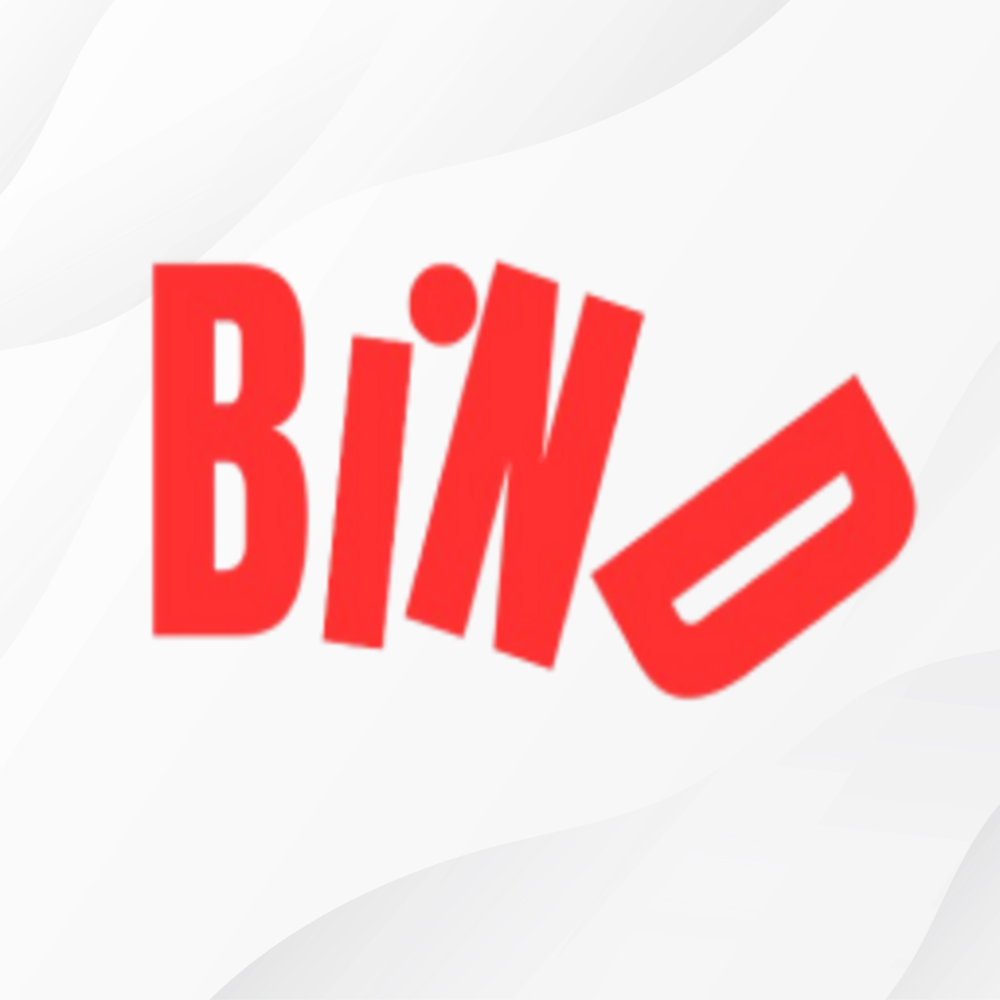
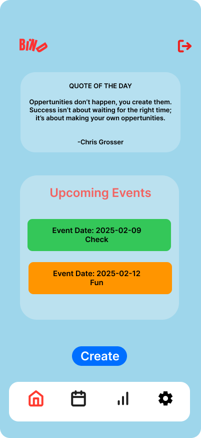
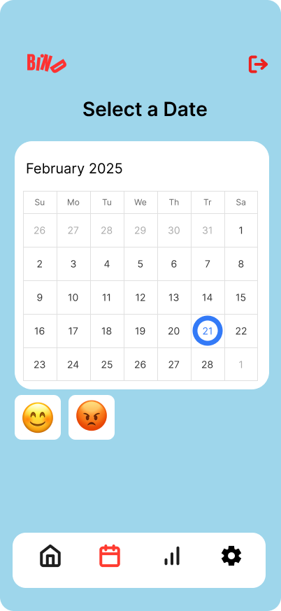
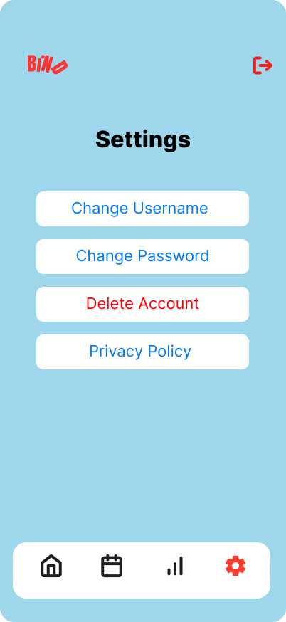
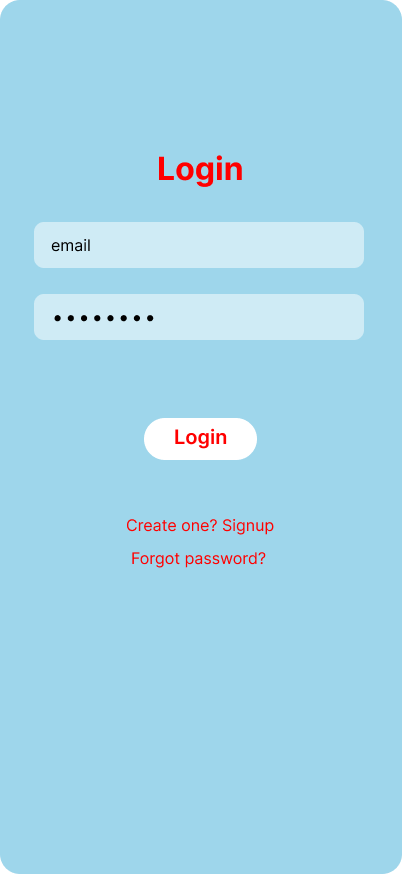
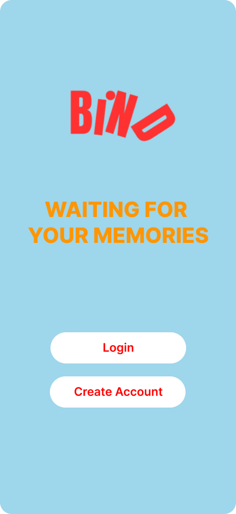
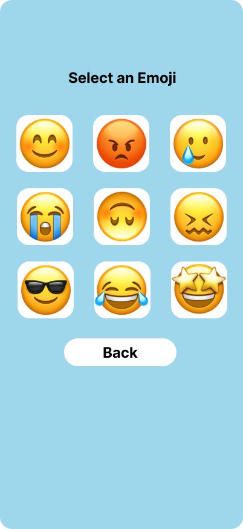
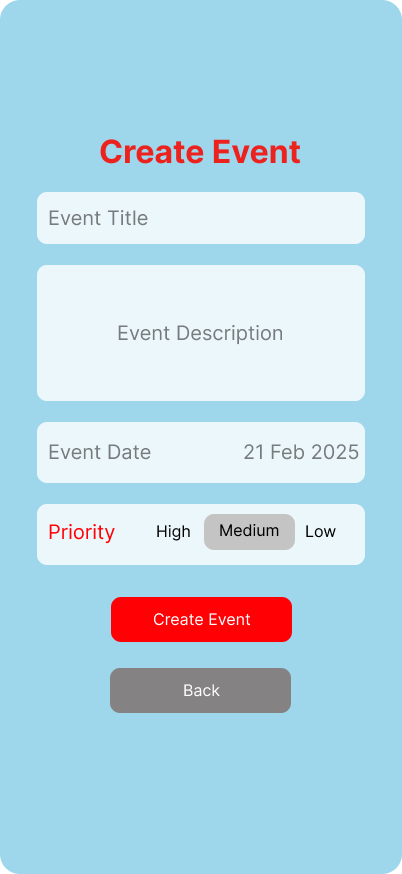

# 📝 **BIND: Personal Diary**

🚀 **Journaling meets  voice-typed, and secure way to capture your thoughts!**



## 🌟 **Overview**
BIND is an innovative, A personal diary app designed for those who value privacy, accessibility, and ease of use. It blends the timeless art of journaling with modern speech-to-text technology, allowing users to record their thoughts effortlessly. With a minimalist design, powerful insights, and a secure PHP backend, BIND transforms the way you reflect and store your memories.

## ✨ **Features**

- 🔒 **Secure Online Storage** – Your journal entries are stored safely using a PHP-powered backend, ensuring privacy and accessibility.
- 🎙️ **Voice Typing** – Hands-free journaling with speech-to-text functionality for effortless note-taking.
- 📊 **Insights & Analytics** – Track journaling habits, discover patterns, and stay motivated.
- 📅 **Calendar View** – Easily navigate past entries and reflect on past moments.
- ⚙️ **Customizable Settings** – Manage your experience with password protection and more.
- 🌿 **Minimalist Interface** – A distraction-free, elegant UI that enhances the journaling experience.

## 🛠️ **Tech Stack**

- **Frontend:** SwiftUI (for iOS)
- **Backend:** PHP (with MySQL for data storage)
- **Speech-to-Text:** Apple's Speech Framework
- **UI Design:** Inspired by modern, clean, and user-friendly aesthetics

## 🚀 **Installation & Setup**

### **1️⃣ Clone the Repository**
```bash
git clone https://github.com/HEMANTH-1508/BIND.git
cd BIND
```

### **2️⃣ Setup Backend (PHP & MySQL)**
- Upload the `backend` folder to your PHP server (XAMPP, Laravel, etc.).
- Import the provided SQL database file into MySQL.
- Update `db_connection.php` with your database credentials.

### **3️⃣ Run the iOS App**
- Open the project in Xcode.
- Ensure dependencies are installed.
- Build & run the app on a simulator or physical device.

## 📸 **Screenshots**

| Home Screen | Calendar | Insights |
|------------|-------------|----------|
|  |  |  |

| Settings | Login | Welcome |
|--------------|------------------|----------|
|  |  |  |

| Signup | Emoji Selector | Event |
|------------|-------------|----------|
|  |  |  |

## 💡 **Challenges & Learnings**
Developing BIND came with key challenges, including:
✔️ Implementing accurate speech-to-text transcription.
✔️ Designing a seamless and user-friendly interface.
✔️ Ensuring secure data storage with PHP backend encryption.
Through continuous testing and iteration, we successfully created a fluid, reliable journaling experience.

## 🚀 **Future Enhancements**

- 🎭 **Advanced Mood Tracking** – AI-based mood analysis from entries.
- 📝 **Personalized Writing Prompts** – Get AI-suggested prompts based on past entries.
- 🔒 **Biometric Authentication** – Secure login with Face ID/Touch ID.
- 🌎 **Multilingual Support** – Expand accessibility for global users.

## 🤝 **Contributing**
We welcome contributions! Fork this repo, create a feature branch, and submit a PR. Let’s make journaling smarter together!

## 📜 **License**
This project is licensed under the MIT License. See the `LICENSE` file for details.

---

💬 **Have questions or feedback?** Open an issue or reach out! Happy journaling! 😊🎙️✍️

